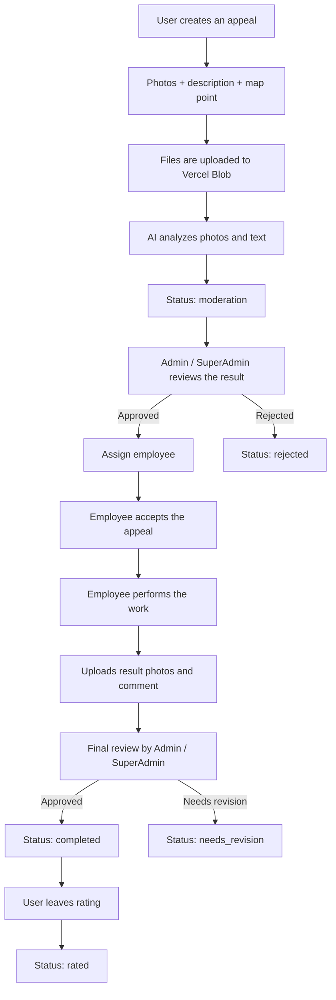
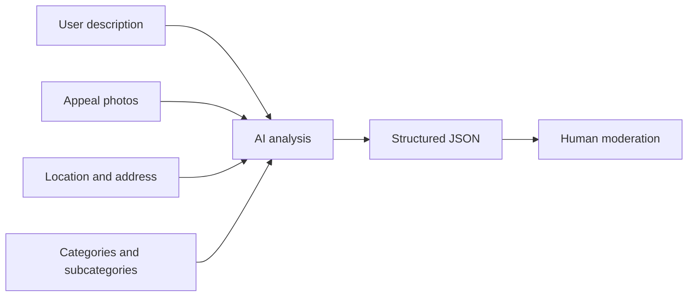

<p align="center">
  
</p>

<h1 align="center">CityHelp</h1>

<p align="center">
  A platform for receiving, analyzing, moderating, and processing citizen appeals
</p>

<p align="center">
  <b>Languages:</b> <a href="https://cityhelp-diploma-yij7.vercel.app/assets/files/CityHelp-ru.pdf">Русский</a> | English
</p>

---

## Contents

- [What This Project Is](#what-this-project-is)
- [Core Product Goals](#core-product-goals)
- [System Roles](#system-roles)
- [Technology Stack](#technology-stack)
- [Project Architecture](#project-architecture)
- [Appeal Flow](#appeal-flow)
- [AI Pipeline](#ai-pipeline)
- [Data And Models](#data-and-models)
- [Maps, Geodata, And Analytics](#maps-geodata-and-analytics)
- [Authorization And Access](#authorization-and-access)
- [File Storage](#file-storage)
- [Deployment And Operations](#deployment-and-operations)
- [Team Workflow And Project Management](#team-workflow-and-project-management)
- [Current Project Status](#current-project-status)
- [Main Pages](#main-pages)
- [Local Setup](#local-setup)
- [Resources](#resources)

---

## What This Project Is

CityHelp is a city-focused digital system for handling citizen appeals.

The platform combines:
- appeal creation with a map, photos, and description
- automatic AI-based analysis
- manual moderation by an administrator
- employee-side execution workflow
- final quality review
- user rating of the final result
- dashboard analytics for appeal monitoring

CityHelp is designed as a single point of interaction between residents, employees, and administration.

---

## Core Product Goals

- make the appeal journey transparent
- reduce manual routine through AI-assisted analysis
- improve classification and routing speed
- keep the full history of each appeal in one place
- control quality through moderation and rating
- provide operational analytics for administration

---

## System Roles

| Role | Responsibility |
|---|---|
| `User` | Creates an appeal, uploads photos, marks a point on the map, tracks statuses, rates the result |
| `Employee` | Receives assigned appeals, accepts them into work, uploads result photos and leaves comments |
| `Admin` | Reviews AI analysis, approves or rejects an appeal, changes assignee, sends work for revision |
| `SuperAdmin` | Can do everything an `Admin` can do and has full system-level control |

---

## Technology Stack

| Layer | Technologies | Purpose |
|---|---|---|
| Frontend | `Nuxt 4`, `Vue 3`, `SCSS` | Interface, pages, components, SSR/SPA logic |
| State management | `Pinia` | Global state for user data, API state, notifications, loaders, and UI logic |
| Backend | `Nitro`, `Node.js`, `h3` | API routes, server logic, middleware, request handling |
| Database | `MongoDB`, `Mongoose` | Storage for appeals, users, categories, FAQ, and AI prompts |
| AI | `Gemini API` | Appeal photo/text analysis, classification, priority, summaries, and evidence |
| Maps | `Yandex Maps API`, `Heatmap module` | Point selection, reverse geocoding, and dashboard heatmap |
| Storage | `Vercel Blob` | Storage for appeal photos, result photos, and avatars |
| i18n | `@nuxtjs/i18n` | Localization for `kz`, `ru`, and `en` |
| UI helpers | `maska`, `nuxt-swiper`, `vue3-tel-input` | Input masks, UI helpers, and phone inputs |
| Hosting | `Vercel` | Production deployment, serverless API hosting, preview workflow |
| Team tools | `GitHub`, `Trello`, `Figma` | Version control, task tracking, and design/product collaboration |

### Interface Languages

- `kz` - default locale
- `ru`
- `en`

---

## Project Architecture

CityHelp is built as a unified Nuxt fullstack project where the client and server live in the same repository.

### Top-Level Structure

| Folder | Purpose |
|---|---|
| `app/` | Client side: pages, components, composables, stores, layouts |
| `server/` | Backend on Nitro: API, controllers, services, models, utilities |
| `i18n/` | Localization config and dictionaries |
| `public/` | Static assets, images, icons, and fonts |

### Backend Structure

| Folder | Purpose |
|---|---|
| `server/api/` | API entry points |
| `server/controllers/` | Request/response orchestration |
| `server/services/` | Business logic |
| `server/models/` | Mongoose schemas and models |
| `server/config/` | Infrastructure configuration such as MongoDB |
| `server/utils/` | Shared utilities |

### Why This Approach Works Well

- frontend and backend stay synchronized in one codebase
- role logic, API logic, and UI logic are easier to manage together
- deployment to Vercel is simpler as a single system
- shared entities and product logic are easier to maintain

---

## Appeal Flow



### Status Lifecycle

| Status | Meaning | Who changes it |
|---|---|---|
| `new` | New confirmed appeal | Admin / SuperAdmin |
| `moderation` | AI already processed the appeal, waiting for human review | System + Admin review |
| `processing` | Appeal is accepted and currently in work | Employee |
| `needs_revision` | The submitted result requires improvement | Admin / SuperAdmin |
| `completed` | Work is accepted as completed | Admin / SuperAdmin |
| `rated` | User has rated the result | User |
| `rejected` | Appeal has been rejected | Admin / SuperAdmin |

### Priorities And Deadlines

| Priority | Meaning | Base deadline |
|---|---|---|
| `low` | Low | 7 days |
| `medium` | Medium | 4 days |
| `high` | High | 3 days |
| `urgent` | Urgent | 1 day |

In the current pipeline, the deadline is calculated on the server based on priority rather than directly by Gemini.

---

## AI Pipeline

In CityHelp, AI does more than simple classification. It prepares a structured analysis for the moderator.

### What AI Receives

- appeal text
- appeal photos
- coordinates and address
- available categories and subcategories
- category reference context

### What AI Produces

| Field | Meaning |
|---|---|
| `photoObservation` | Short description of what is visible in the image |
| `photoDetails` | Detailed visual findings |
| `shortSummary` | Short summary of the issue |
| `analysisSummary` | Explanation of the analysis |
| `category` | Main category |
| `subCategory` | Subcategory |
| `priority` | Appeal priority |
| `evidence` | Facts supporting the result |
| `uncertainties` | What remains unclear |
| `needsClarification` | Whether clarification is needed |
| `categoryReason` | Why this category was chosen |
| `subCategoryReason` | Why this subcategory was chosen |
| `priorityReason` | Why this priority was chosen |

### Pipeline Structure



### Important Notes

- `Gemini` is used with model fallback logic
- AI responds in JSON format
- prompts can be stored and edited in the database
- there is a dedicated admin UI for `AI prompts`
- the final moderation decision always remains with a human

---

## Data And Models

Main entities in MongoDB:

| Entity | Purpose |
|---|---|
| `Appeal` | Appeal record, statuses, location, photos, AI result, timeline, rating |
| `User` | User, employee, admin, or superadmin |
| `Category` | Appeal categories and subcategories |
| `Faq` | FAQ knowledge base |
| `Prompt` | AI prompts and versions |
| `AiTrainingCase` | Cases used to review and improve AI quality |

### What `Appeal` Stores

- appeal author
- issue description
- up to 5 user photos
- coordinates and address
- category and subcategory
- priority and deadline
- assigned employee
- moderation and execution notes
- result photos
- `aiResult`
- `timeline` of the full appeal journey
- user `rating`

### Why MongoDB Fits This Product

- nested structures like `location`, `timeline`, `rating`, and `aiResult` are easy to store
- schemas can evolve without heavy relational migrations
- it works well for the document-oriented shape of an appeal
- Mongoose provides validation, indexes, and model-level structure

---

## Maps, Geodata, And Analytics

### Why Yandex Maps Is Used

- the user selects the appeal location on the map
- the system saves `x/y` coordinates
- reverse geocoding is used to resolve the address
- the appeal is stored together with location data

### Heatmap

There is a heatmap on the dashboard.

It is used to:
- identify hot spots across the city
- quickly understand issue concentration
- support dashboard analytics for administration

---

## Authorization And Access

The project includes registration, login, logout, and role-based access control.

### What Is Used

- the token is generated on the server
- the token is stored in a cookie
- the user role is included in the payload
- middleware and API routes verify permissions for routes and actions

### Why It Matters

- separates user flows from admin flows
- provides role-based access to actions
- protects moderation, staff, and admin tools

---

## File Storage

`Vercel Blob` is used for images and file storage.

### Base Storage Structure

| File type | Path |
|---|---|
| User photos | `cityhelp/appeals/<appealId>/photos/*` |
| Result photos | `cityhelp/appeals/<appealId>/fixed-images/*` |
| Avatars | `cityhelp/avatars/<userId>/*` |

### Why It Is Convenient

- each file set is tied to a specific entity
- it is easier to delete all appeal-related files when needed
- the structure is predictable and scalable
- storage stays cleaner in production

---

## Deployment And Operations

### Production

- production deployment is hosted on `Vercel`
- backend functionality runs through Nuxt/Nitro server API routes
- images and attachments are stored in `Vercel Blob`

### Operational Notes

- production build and API behavior can be verified in one environment
- Vercel logs are useful for diagnosing backend behavior
- API errors return `statusCode` and `statusMessage`, which helps debugging

### Runtime Configuration

The project uses runtime configuration for:
- MongoDB
- auth secret
- Gemini API
- base API URL

Secrets should be stored through environment variables and Vercel project settings.

---

## Team Workflow And Project Management

### Tooling

| Tool | How it is used |
|---|---|
| `Trello` | Task tracking, priorities, weekly planning, backlog, bugs, and test workflow |
| `GitHub` | Repository, change history, branching, and collaboration |
| `Figma` | UI structure, materials, and design/product discussions |
| `Vercel` | Production deployment and deployment verification |

### Typical Workflow

1. a task is created in `Trello`
2. structure and priority are discussed
3. implementation is done in code and tracked in `GitHub`
4. the feature is deployed through `Vercel`
5. production behavior and logs are checked if needed

### Why This Works Well

- priorities stay visible
- task status is easy to understand
- work is distributed clearly between contributors
- the path from idea to deployment stays fast

---

## Current Project Status

The status below is based on the project board and is current as of **April 14, 2026**.

### Completed

#### Done: 06.04.26 - 12.04.26

- create appeal flow and main API flow
- connect `Gemini AI` to the server
- implement `Login / Register API`
- connect AI token flow

#### Done: 13.04.26 - 19.04.26

- user profile
- AI training for more accurate analysis
- discussion and clarification of all status types
- priority-based deadlines
- database structure

### Currently In Progress

- materials for the landing page

### Planned For The Upcoming Week

- `Employee` department / division
- user -> employee system
- docs API

### In Testing And Backlog

- testing
- full translation
- multi-city split

### Postponed Or Rejected

- corporate email `info@cityhelp.com / .kz`
- moving the domain from `PS.kz` to a separate server
- `2GIS API` integration

---

## Main Pages

| Page | Purpose |
|---|---|
| `/` | Landing page |
| `/panel` | Main analytics dashboard |
| `/panel/create-appeal` | Appeal creation |
| `/panel/appeal/:id` | Appeal detail page |
| `/panel/edit-appeal/:id` | Appeal editing during moderation |
| `/panel/user/my-appeals` | User appeal history |
| `/panel/employee/appeals` | Employee queue |
| `/panel/admin/appeals` | Main admin appeal list |
| `/panel/admin/users` | User management |
| `/panel/admin/staff` | Staff list and statistics |
| `/panel/admin/categories` | Category management |
| `/panel/admin/faq` | FAQ management |
| `/panel/admin/prompts` | AI prompt management |
| `/panel/admin/translations` | Translation management |

---

## Local Setup

### Requirements

- `Node.js`
- `npm`
- MongoDB access
- configured runtime secrets for AI and storage

### Commands

```bash
npm install
npm run dev
```

### Scripts

```bash
npm run dev
npm run build
npm run generate
npm run preview
```

---

## Resources

| Resource | Link |
|---|---|
| Production | https://cityhelp-diploma-yij7.vercel.app |
| GitHub | https://github.com/yenlikksarybay/cityhelp-diploma |
| Trello board | https://trello.com/b/aotyaf6W/cityhelp-diploma |

---

## Summary

CityHelp is not just a complaint form. It is a full appeal-processing lifecycle:

1. the user creates an appeal
2. the system stores location and files
3. AI performs the initial structured analysis
4. administration reviews and routes the appeal
5. the employee performs the work
6. administration verifies the result
7. the user rates the outcome

This approach makes the process:
- transparent
- manageable
- scalable
- understandable for the user
- practical for employees
- controllable for administration

