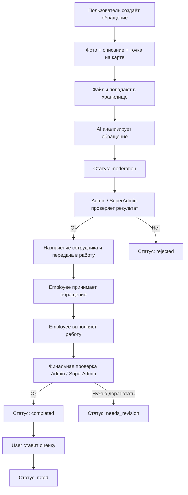
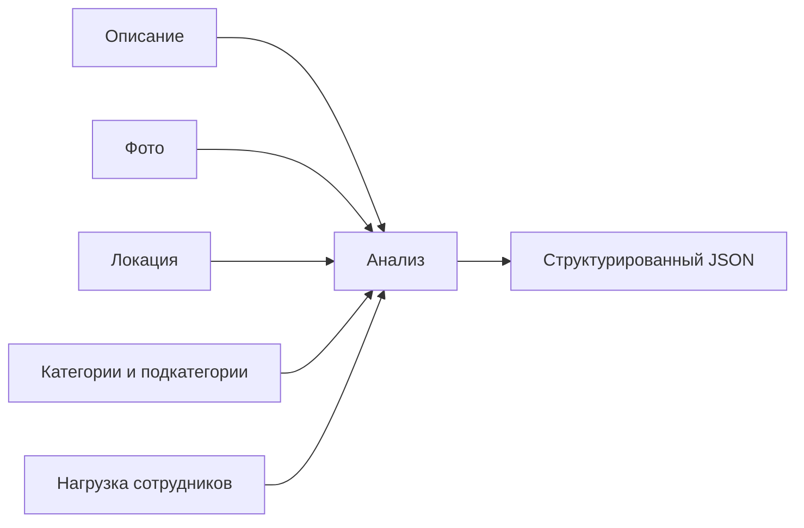
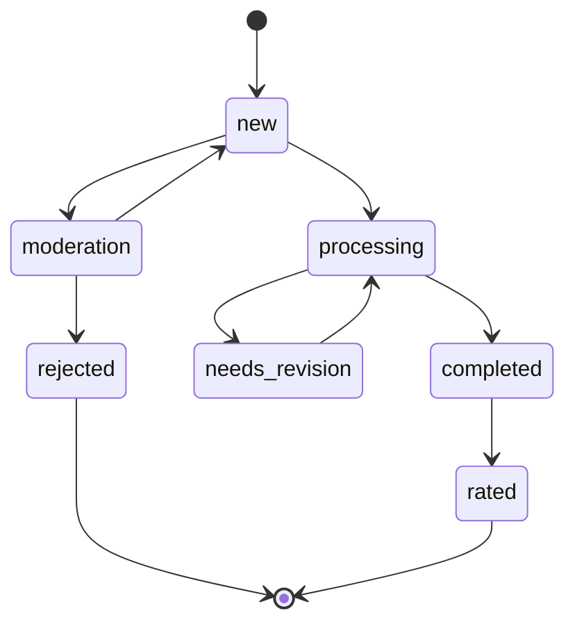
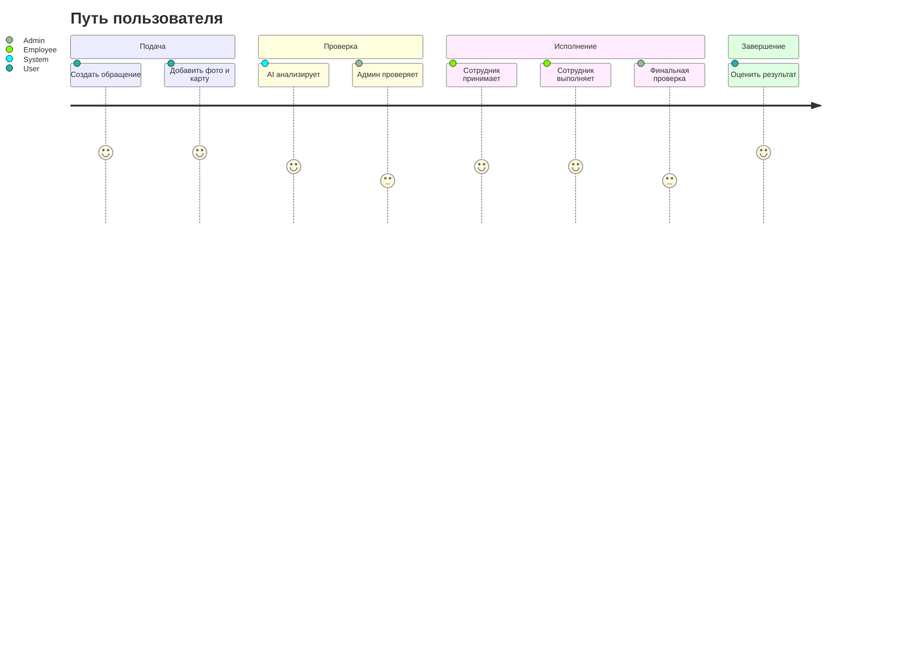

  

<h1 align="center">CityHelp</h1>

  Платформа для приёма, анализа, модерации и сопровождения обращений граждан

---

## Содержание

- [Что это за проект](#что-это-за-проект)
- [Кто пользуется системой](#кто-пользуется-системой)
- [Как устроен флоу обращения](#как-устроен-флоу-обращения)
- [Жизненный цикл обращения](#жизненный-цикл-обращения)
- [Роли и зоны ответственности](#роли-и-зоны-ответственности)
- [Что анализирует AI](#что-анализирует-ai)
- [Как хранится информация](#как-хранится-информация)
- [Разделы интерфейса](#разделы-интерфейса)
- [FAQ и знания](#faq-и-знания)
- [Категории обращений](#категории-обращений)
- [Панель управления](#панель-управления)
- [Статусы и приоритеты](#статусы-и-приоритеты)
- [Технологии](#технологии)
- [Ресурсы](#ресурсы)

---

## Что это за проект

CityHelp - это городская цифровая система для работы с обращениями граждан.

Платформа объединяет:
- создание обращения с картой, фото и описанием
- автоматический анализ обращения с помощью AI
- ручную проверку модератором
- работу сотрудника по исполнению
- финальную проверку качества
- оценку результата пользователем

Цель проекта:
- сделать путь обращения прозрачным
- сократить ручную рутину
- повысить качество маршрутизации обращений
- сохранить единый контроль качества на стороне администрации

---

## Кто пользуется системой

| Роль | Что делает |
|---|---|
| User | Создаёт обращение, отслеживает статус, получает результат, ставит оценку |
| Employee | Получает назначенные обращения, принимает их в работу, прикладывает фото результата, пишет комментарий |
| Admin | Проверяет AI-решение, меняет исполнителя, модерирует, отправляет на доработку или отклоняет |
| SuperAdmin | Делает всё, что Admin, и имеет полный контроль над системой |

---

## Как устроен флоу обращения

---

## Жизненный цикл обращения

| Статус | Что означает | Кто переводит |
|---|---|---|
| `new` | Обращение подтверждено и готово к работе | Admin / SuperAdmin |
| `moderation` | AI уже проанализировал обращение, но оно ждёт проверки администратора | AI |
| `processing` | Обращение принято сотрудником и находится в работе | Employee |
| `needs_revision` | Работа требует исправлений или уточнений | Admin / SuperAdmin |
| `completed` | Обращение считается выполненным | Admin / SuperAdmin |
| `rated` | Пользователь поставил оценку | User |
| `rejected` | Обращение отклонено как некорректное или ложное | Admin / SuperAdmin |

### Что важно

- После AI обращение не попадает сразу в общие рабочие списки.
- Сначала его проверяет человек.
- Только после подтверждения обращение становится рабочим для сотрудника.
- Отклонённые обращения сохраняются в истории и видны в списках.

---

## Роли и зоны ответственности

### User
- создаёт обращение
- добавляет описание
- отмечает точку на карте
- прикладывает до 5 изображений
- отслеживает этапы
- видит итог выполнения
- ставит оценку только завершённым обращениям

### Employee
- видит только назначенные ему обращения
- принимает обращение в работу
- прикладывает фото результата
- добавляет комментарий по выполнению
- передаёт на проверку
- отслеживает личную статистику

### Admin / SuperAdmin
- контролируют корректность AI-анализа
- меняют сотрудника, если назначение неверное
- отклоняют ложные или некорректные обращения
- могут вернуть обращение на доработку
- подтверждают завершение
- управляют справочниками, FAQ и промтами

---

## Что анализирует AI

AI не просто классифицирует обращение, а формирует подробный разбор.

### На вход AI получает
- текст обращения
- координаты и адрес
- изображения
- доступные категории и подкатегории
- текущую нагрузку сотрудников

### На выход AI формирует

| Поле | Что содержит |
|---|---|
| `photoObservation` | Что видно на фото в краткой форме |
| `photoDetails` | Детализированные наблюдения по изображению |
| `shortSummary` | Короткая и понятная сводка по обращению |
| `analysisSummary` | Объяснение логики анализа |
| `category` | Основная категория |
| `subCategory` | Подкатегория |
| `priority` | Приоритет |
| `deadlineDate` | Дата предполагаемого решения |
| `assignedEmployee` | Рекомендованный сотрудник |
| `evidence` | Факты, на которых основан вывод |
| `uncertainties` | Что осталось неясным |
| `needsClarification` | Требуется ли уточнение |
| `reasons` | Отдельные пояснения по каждому решению |

### Логика AI

### Что AI делает особенно
- читает фото
- описывает, что именно увидел
- объясняет, почему выбран такой приоритет
- подбирает сотрудника с меньшей нагрузкой
- рассчитывает дедлайн датой, а не часами
- отправляет обращение на модерацию, а не в работу напрямую

---

## Как хранится информация

### Файлы обращений

| Тип файла | Папка |
|---|---|
| Фото пользователя | `cityhelp/appeals/<appealId>/photos` |
| Фото сотрудника после выполнения | `cityhelp/appeals/<appealId>/fixed-images` |
| Другие вложения обращения | `cityhelp/appeals/<appealId>/...` |

### Почему так удобно
- каждый набор файлов связан с конкретным обращением
- легко удалять все файлы обращения целиком
- проще поддерживать порядок в хранилище
- структура предсказуемая и расширяемая

### Основные сущности

| Сущность | Назначение |
|---|---|
| Appeal | Само обращение и его история |
| User | Пользователь, сотрудник, админ или супер-админ |
| Category | Категория и подкатегории обращений |
| Faq | Справочные вопросы и ответы |
| Prompt | Базовые и обучающие инструкции AI |

---

## Разделы интерфейса

### Публичная часть

| Раздел | Что показывает |
|---|---|
| Главная | Общее представление о сервисе |
| FAQ | Ответы на частые вопросы |
| О проекте | Краткое описание CityHelp |

### Пользовательская часть

| Раздел | Что показывает |
|---|---|
| Создать обращение | Форма подачи обращения |
| Мои обращения | История и статусы |
| Детальная страница обращения | История, комментарии, результаты и оценка |

### Сотрудник

| Раздел | Что показывает |
|---|---|
| Обращения | Очередь назначенных, активных, завершённых и отклонённых |
| Детальная страница обращения | Выполнение, фото результата, комментарии |

### Администрация

| Раздел | Что показывает |
|---|---|
| Обращения | Общий список и фильтры |
| Пользователи | Список пользователей и их обращения |
| Сотрудники | Список сотрудников и статистика |
| FAQ | Управление справкой |
| Категории | Управление категориями и подкатегориями |
| AI Промты | Управление и тестирование AI-инструкций |

---

## FAQ и знания

FAQ хранится отдельно как управляемая база знаний.

### Что умеет FAQ
- показывать частые вопросы пользователю
- редактироваться администрацией
- автоматически иметь базовый набор вопросов
- поддерживать удобный аккордеон для просмотра

### Примеры тем FAQ
- как создать обращение
- когда доступна оценка
- почему обращение сначала уходит на проверку
- как понять текущий статус

---

## Категории обращений

Категории стали отдельным справочником с подкатегориями.

### Что это даёт
- AI точнее определяет тип проблемы
- модератору проще проверять классификацию
- список обращений становится понятнее для пользователя

### Пример структуры

| Категория | Подкатегории |
|---|---|
| Дороги | Ямы, освещение, разметка, дорожные знаки |
| ЖКХ | Мусор, двор, подъезд, вода, отопление |
| Освещение | Улица, двор, подъезд, парковая зона |
| Отходы и уборка | Вывоз мусора, свалка, контейнер, уборка территории |
| Общие вопросы | Прочее, уточнение, несколько проблем |

---

## Панель управления

### Что видно на панели

| Блок | Смысл |
|---|---|
| Сводка | Количество обращений и общая активность |
| Тепловая карта | Распределение обращений по городу |
| Список обращений | Быстрый доступ к деталям |
| Статистика по ролям | Пользователи, сотрудники, рейтинги |

### Для чего это нужно
- быстро понять нагрузку
- увидеть горячие точки
- оценить качество обработки
- контролировать работу сотрудников и модерации

---

## Статусы и приоритеты

### Приоритеты

| Приоритет | Смысл |
|---|---|
| `low` | Низкий |
| `medium` | Средний |
| `high` | Высокий |
| `urgent` | Срочный |

### Как определяется дедлайн

| Приоритет | Примерный срок |
|---|---|
| `urgent` | 1 день |
| `high` | 3 дня |
| `medium` | 4 дня |
| `low` | 7 дней |

### Что важно
- дедлайн хранится как дата
- AI рассчитывает его на основе приоритета и контекста
- администрация может скорректировать решение

---

## Визуальная карта состояний

---

## Пользовательский путь

---

## Краткая карта разделов

| Страница | Смысл |
|---|---|
| `/panel` | Главная панель с аналитикой |
| `/panel/create-appeal` | Создание нового обращения |
| `/panel/appeal/:id` | Детальная карточка обращения |
| `/panel/edit-appeal/:id` | Редактирование обращения на модерации |
| `/panel/user/my-appeals` | Мои обращения пользователя |
| `/panel/employee/appeals` | Очередь сотрудника |
| `/panel/admin/appeals` | Общий список для администрации |
| `/panel/admin/users` | Пользователи и их обращения |
| `/panel/admin/staff` | Сотрудники и их статистика |
| `/panel/faq` | FAQ для пользователя |
| `/panel/admin/faq` | Управление FAQ |
| `/panel/admin/categories` | Управление категориями |
| `/panel/admin/prompts` | Управление AI-инструкциями |

---

## Технологии

| Слой | Технологии |
|---|---|
| Интерфейс | Vue 3, Nuxt 4, SCSS |
| Серверная часть | Nitro, Node.js |
| Данные | MongoDB |
| AI | Gemini API |
| Хранилище | Blob storage |
| Состояние | Pinia |

---

## Ресурсы

| Ресурс | Ссылка |
|---|---|
| Веб-версия | https://cityhelp-diploma-yij7.vercel.app |
| GitHub | https://github.com/yenlikksarybay/cityhelp-diploma |

---

## Итог

CityHelp - это не просто форма для жалоб.
Это полный цикл:

1. пользователь создаёт обращение
2. AI делает первичный анализ
3. администрация подтверждает или отклоняет решение
4. сотрудник выполняет работу
5. администрация проверяет результат
6. пользователь оценивает итог

Такой подход делает процесс:
- прозрачным
- управляемым
- понятным для пользователя
- удобным для сотрудников
- контролируемым для администрации
