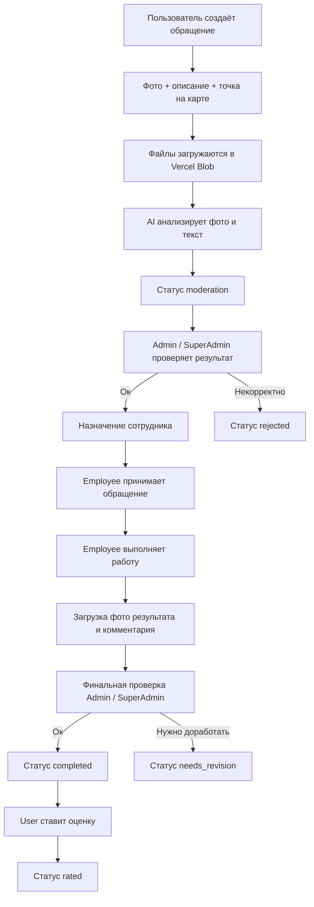
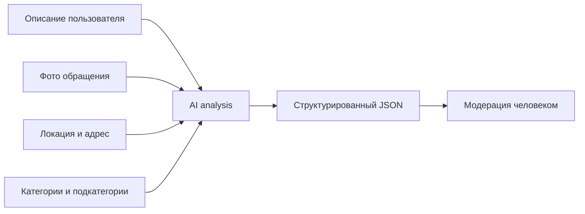

<p align="center">
  
</p>

<h1 align="center">CityHelp</h1>

<p align="center">
  Платформа для приёма, анализа, модерации и сопровождения обращений граждан
</p>

<p align="center">
  <b>Languages:</b> Русский | <a href="https://cityhelp-diploma-yij7.vercel.app/assets/files/CityHelp-en.pdf">English</a>
</p>

---

## Содержание

- [Что это за проект](#что-это-за-проект)
- [Основные задачи продукта](#основные-задачи-продукта)
- [Роли в системе](#роли-в-системе)
- [Технологический стек](#технологический-стек)
- [Архитектура проекта](#архитектура-проекта)
- [Флоу обращения](#флоу-обращения)
- [AI-пайплайн](#ai-пайплайн)
- [Данные и модели](#данные-и-модели)
- [Карта, геоданные и аналитика](#карта-геоданные-и-аналитика)
- [Авторизация и доступы](#авторизация-и-доступы)
- [Хранилище файлов](#хранилище-файлов)
- [Deployment и эксплуатация](#deployment-и-эксплуатация)
- [Командная работа и управление проектом](#командная-работа-и-управление-проектом)
- [Текущий статус проекта](#текущий-статус-проекта)
- [Основные страницы](#основные-страницы)
- [Локальный запуск](#локальный-запуск)
- [Ресурсы](#ресурсы)

---

## Что это за проект

CityHelp - это городская цифровая система для работы с обращениями граждан.

Платформа объединяет:
- создание обращения с картой, фото и описанием
- автоматический анализ обращения с помощью AI
- ручную проверку модератором
- работу сотрудника по исполнению
- финальную проверку качества
- оценку результата пользователем
- аналитику по обращениям для панели управления

CityHelp задуман как единая точка для взаимодействия жителей, сотрудников и администрации.

---

## Основные задачи продукта

- сделать путь обращения прозрачным
- сократить ручную рутину за счёт AI-анализа
- ускорить классификацию и маршрутизацию обращений
- хранить историю по каждому обращению в одном месте
- контролировать качество выполнения через модерацию и оценку
- дать администрации оперативную аналитику по обращениям

---

## Роли в системе

| Роль | Что делает |
|---|---|
| `User` | Создаёт обращение, прикладывает фото, указывает точку на карте, отслеживает статус, оценивает результат |
| `Employee` | Получает назначенные обращения, принимает их в работу, прикладывает фото результата и комментарий |
| `Admin` | Проверяет AI-анализ, подтверждает или отклоняет обращение, меняет исполнителя, отправляет на доработку |
| `SuperAdmin` | Делает всё, что `Admin`, и управляет системой на полном уровне |

---

## Технологический стек

| Слой | Технологии | Для чего используется |
|---|---|---|
| Frontend | `Nuxt 4`, `Vue 3`, `SCSS` | Интерфейс, страницы, компоненты, SSR/SPA-логика |
| State management | `Pinia` | Глобальное состояние пользователя, API, уведомлений, loader и UI-состояний |
| Backend | `Nitro`, `Node.js`, `h3` | API-роуты, серверная логика, middleware, обработка запросов |
| Database | `MongoDB`, `Mongoose` | Хранение обращений, пользователей, категорий, FAQ и AI-prompts |
| AI | `Gemini API` | Анализ фото и текста, классификация обращения, приоритет, summaries и evidence |
| Maps | `Yandex Maps API`, `Heatmap module` | Выбор точки на карте, обратное геокодирование адреса, тепловая карта обращений |
| Storage | `Vercel Blob` | Хранение фото пользователя, фото выполненных работ и аватаров |
| i18n | `@nuxtjs/i18n` | Локализация интерфейса на `kz`, `ru`, `en` |
| UI helpers | `maska`, `nuxt-swiper`, `vue3-tel-input` | Маски ввода, UI-компоненты, телефонные поля |
| Hosting | `Vercel` | Production deployment, serverless API, preview/deploy workflow |
| Team tools | `GitHub`, `Trello`, `Figma` | Контроль версий, постановка задач, обсуждение дизайна и структуры |

### Языки интерфейса

- `kz` - default locale
- `ru`
- `en`

---

## Архитектура проекта

CityHelp собран как единый Nuxt-проект, где клиентская и серверная части находятся в одном репозитории.

### Структура верхнего уровня

| Папка | Назначение |
|---|---|
| `app/` | Клиентская часть: страницы, компоненты, composables, stores, layouts |
| `server/` | Backend на Nitro: API, controllers, services, models, utils |
| `i18n/` | Конфигурация и словари локализации |
| `public/` | Статические файлы, изображения, иконки, шрифты |

### Backend-структура

| Папка | Назначение |
|---|---|
| `server/api/` | Точки входа API |
| `server/controllers/` | Оркестрация запроса и ответа |
| `server/services/` | Бизнес-логика |
| `server/models/` | Mongoose-схемы и модели |
| `server/config/` | Инфраструктурная конфигурация, например MongoDB |
| `server/utils/` | Вспомогательные функции |

### Почему такой подход удобен

- фронтенд и бэкенд синхронизированы в одном проекте
- проще управлять ролями, API и UI без отдельного микросервисного слоя
- удобно выкатывать проект на Vercel как единый deployment
- проще поддерживать общие типы данных и структуру сущностей

---

## Флоу обращения



### Жизненный цикл статусов

| Статус | Что означает | Кто переводит |
|---|---|---|
| `new` | Новое подтверждённое обращение | Admin / SuperAdmin |
| `moderation` | AI уже сработал, обращение ждёт ручной проверки | System + Admin review |
| `processing` | Обращение принято сотрудником и находится в работе | Employee |
| `needs_revision` | Нужна доработка результата | Admin / SuperAdmin |
| `completed` | Работа принята и считается выполненной | Admin / SuperAdmin |
| `rated` | Пользователь поставил оценку | User |
| `rejected` | Обращение отклонено | Admin / SuperAdmin |

### Приоритеты и дедлайны

| Приоритет | Смысл | Базовый срок |
|---|---|---|
| `low` | Низкий | 7 дней |
| `medium` | Средний | 4 дня |
| `high` | Высокий | 3 дня |
| `urgent` | Срочный | 1 день |

В актуальном пайплайне дедлайн рассчитывается сервером по приоритету, а не напрямую Gemini.

---

## AI-пайплайн

AI в CityHelp не просто определяет категорию. Он помогает подготовить структурированный разбор обращения для модератора.

### Что получает AI

- текст обращения
- фотографии
- координаты и адрес
- список доступных категорий и подкатегорий
- контекст по справочнику категорий

### Что формируется на выходе

| Поле | Смысл |
|---|---|
| `photoObservation` | Краткое описание того, что видно на фото |
| `photoDetails` | Детали визуального анализа |
| `shortSummary` | Короткая сводка проблемы |
| `analysisSummary` | Объяснение логики анализа |
| `category` | Основная категория |
| `subCategory` | Подкатегория |
| `priority` | Приоритет обращения |
| `evidence` | Факты, на которых основан вывод |
| `uncertainties` | Что осталось неясным |
| `needsClarification` | Нужно ли уточнение |
| `categoryReason` | Почему выбрана эта категория |
| `subCategoryReason` | Почему выбрана эта подкатегория |
| `priorityReason` | Почему присвоен такой приоритет |

### Как устроен пайплайн



### Важные особенности

- используется `Gemini` с fallback по моделям
- AI отвечает в формате JSON
- промты можно хранить и редактировать в базе
- есть отдельная админка для `AI prompts`
- финальное решение по модерации остаётся за человеком

---

## Данные и модели

Основные сущности в MongoDB:

| Сущность | Для чего нужна |
|---|---|
| `Appeal` | Обращение, статусы, локация, фото, AI-результат, timeline, rating |
| `User` | Пользователь, сотрудник, администратор, супер-админ |
| `Category` | Категории и подкатегории обращений |
| `Faq` | База частых вопросов |
| `Prompt` | AI-промты и их версии |
| `AiTrainingCase` | Кейсы для анализа и улучшения качества AI |

### Что хранится в `Appeal`

- автор обращения
- описание проблемы
- до 5 пользовательских фото
- координаты и адрес
- категория и подкатегория
- приоритет и дедлайн
- назначенный сотрудник
- комментарии модерации и исполнения
- фото выполненной работы
- `aiResult`
- `timeline` со всей историей изменений
- `rating` пользователя

### Почему MongoDB подошёл проекту

- удобно хранить вложенные структуры вроде `location`, `timeline`, `rating`, `aiResult`
- легко расширять схему без тяжёлых миграций
- хорошо подходит под документную модель обращения
- Mongoose даёт валидации, индексы и контроль модели

---

## Карта, геоданные и аналитика

### Для чего используется Yandex Maps

- пользователь выбирает точку обращения на карте
- система получает координаты `x/y`
- выполняется обратное геокодирование для адреса
- обращение сохраняется вместе с локацией

### Heatmap

На дашборде есть тепловая карта обращений.

Она нужна, чтобы:
- видеть горячие точки по городу
- быстро понимать концентрацию проблем
- использовать аналитику для панели управления

---

## Авторизация и доступы

В проекте есть регистрация, логин, logout и role-based access.

### Что используется

- токен создаётся на сервере
- токен кладётся в cookie
- роль пользователя передаётся в payload
- middleware и API проверяют право доступа к роутам и действиям

### Зачем это нужно

- отделение пользовательского сценария от административного
- безопасное управление действиями по ролям
- ограничение доступа к модерации, staff и admin-инструментам

---

## Хранилище файлов

Для изображений и файлов используется `Vercel Blob`.

### Базовая структура хранения

| Тип файла | Путь |
|---|---|
| Фото пользователя | `cityhelp/appeals/<appealId>/photos/*` |
| Фото после выполнения | `cityhelp/appeals/<appealId>/fixed-images/*` |
| Аватары | `cityhelp/avatars/<userId>/*` |

### Почему так удобно

- каждый набор файлов привязан к конкретной сущности
- проще удалять файлы обращения целиком
- структура предсказуемая и масштабируемая
- удобно поддерживать порядок в production storage

---

## Deployment и эксплуатация

### Production

- production deployment размещён на `Vercel`
- backend работает через серверные API-роуты Nuxt/Nitro
- изображения и вложения хранятся в `Vercel Blob`

### Что важно в эксплуатации

- при выкладке легко проверять production-сборку и API в одном окружении
- для диагностики серверной части можно использовать Vercel logs
- ошибки API возвращаются со `statusCode` и `statusMessage`, что упрощает отладку

### Runtime-конфигурация

В проекте используются runtime-параметры для:
- MongoDB
- auth secret
- Gemini API
- base API URL

Рекомендуется хранить секреты через environment variables и настройки Vercel.

---

## Командная работа и управление проектом

### Как организована работа

| Инструмент | Как используется |
|---|---|
| `Trello` | Постановка задач, приоритеты, weekly-планирование, backlog, bugs, test |
| `GitHub` | Репозиторий, история изменений, ветки, совместная разработка |
| `Figma` | Обсуждение структуры интерфейса, материалов и визуальной части |
| `Vercel` | Production deployment и проверка выкладок |

### Как выглядит процесс

1. задача попадает в `Trello`
2. обсуждается структура решения и приоритет
3. изменения делаются в коде и фиксируются в `GitHub`
4. после проверки функционал выкатывается на `Vercel`
5. при необходимости проверяются production logs и поведение API

### Что это даёт команде

- видимость приоритетов
- понятный статус по задачам
- разделение работы между участниками
- быстрый цикл от идеи до выкладки

---

## Основные страницы

| Страница | Назначение |
|---|---|
| `/` | Главная страница |
| `/panel` | Главная панель с аналитикой |
| `/panel/create-appeal` | Создание обращения |
| `/panel/appeal/:id` | Детальная страница обращения |
| `/panel/edit-appeal/:id` | Редактирование обращения на модерации |
| `/panel/user/my-appeals` | История обращений пользователя |
| `/panel/employee/appeals` | Очередь сотрудника |
| `/panel/admin/appeals` | Общий административный список |
| `/panel/admin/users` | Пользователи |
| `/panel/admin/staff` | Сотрудники и их статистика |
| `/panel/admin/categories` | Управление категориями |
| `/panel/admin/faq` | Управление FAQ |
| `/panel/admin/prompts` | Управление AI-prompts |
| `/panel/admin/translations` | Управление переводами |

---

## Локальный запуск

### Требования

- `Node.js`
- `npm`
- доступ к MongoDB
- настроенные runtime secrets для AI и storage

### Команды

```bash
npm install
npm run dev
```

### Scripts

```bash
npm run dev
npm run build
npm run generate
npm run preview
```

---

## Ресурсы

| Ресурс | Ссылка |
|---|---|
| Production | https://cityhelp-diploma-yij7.vercel.app |
| GitHub | https://github.com/yenlikksarybay/cityhelp-diploma |
| Trello board | https://trello.com/b/aotyaf6W/cityhelp-diploma |

---

## Итог

CityHelp - это не просто форма для жалоб, а полный цикл обработки городского обращения:

1. пользователь создаёт обращение
2. система сохраняет локацию и файлы
3. AI делает первичный структурированный анализ
4. администрация проверяет и направляет обращение дальше
5. сотрудник выполняет работу
6. администрация проверяет результат
7. пользователь оценивает итог

Такой подход делает процесс:
- прозрачным
- управляемым
- масштабируемым
- понятным для пользователя
- удобным для сотрудников
- контролируемым для администрации
